# HEL — Hybrid Event Link

A high-performance sharded bounded MPMC/SPSC channel library for Rust with unified sync and async API.

I was inspired by:

 - Crossbeam

 - Flume

## Why HEL?

HEL is designed around multi-core hardware.

Most channel libraries make you choose: sync **or** async. hel gives you both on the same channel — a sync thread and an async task can share the same channel without bridges or wrappers.

hel is also sharded. Instead of one ring buffer shared by all producers, hel creates N independent ring buffers. Producers route messages by key or round-robin. This eliminates the main bottleneck of classic MPMC channels: contention on a single tail pointer.

### Version

- Current version is - `1.2.1`
- Changes are documented in `change_log/v{version}.md`

## Benchmark results — X86 (MACOS)

> Benchmarks use 1 000 000 messages per run; payload is a Binance trade tick (Copy struct, &'static str fields, ~80 B). Higher is better.

### sync_mpmc

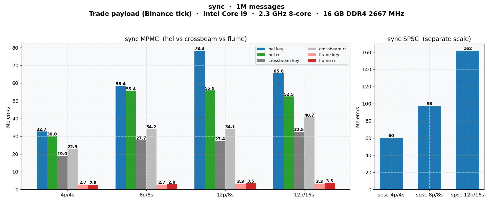

### async_sharded

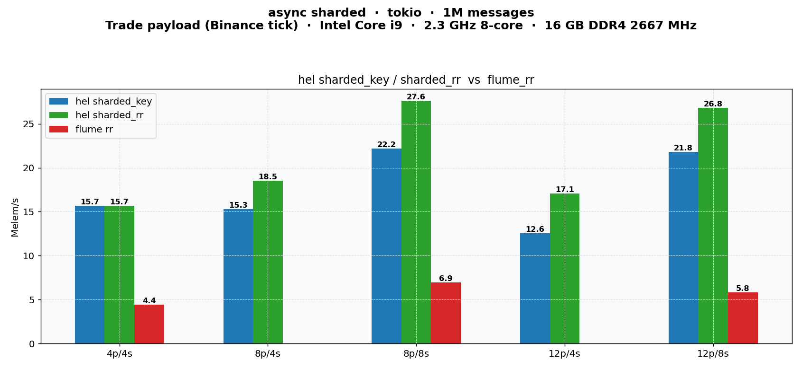

### scaling

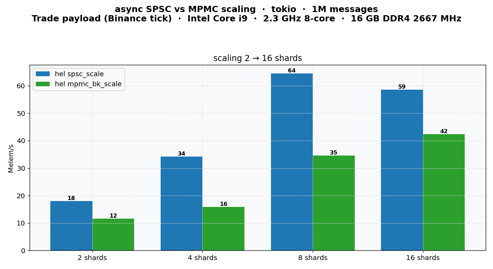

### batch

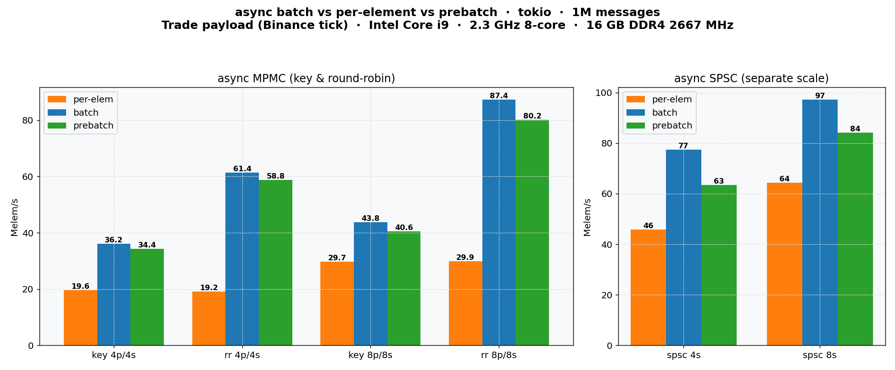


## Benchmark results — X86 (Ubuntu 26.04)

> Benchmarks use 1 000 000 messages per run; payload is a Binance trade tick (Copy struct, &'static str fields, ~80 B). Higher is better.

### sync_mpmc

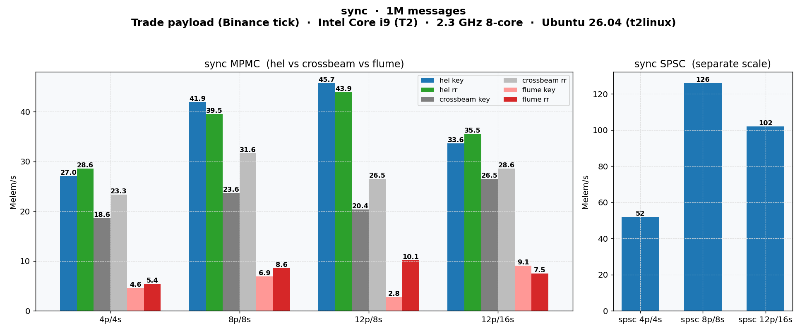

### async_sharded

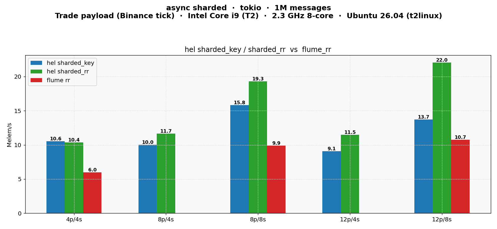

### scaling

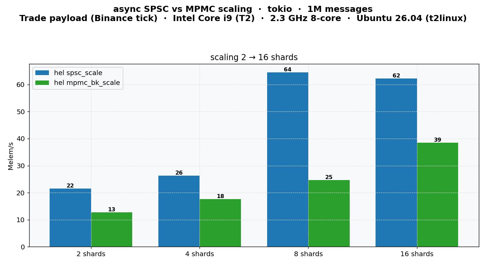

### batch

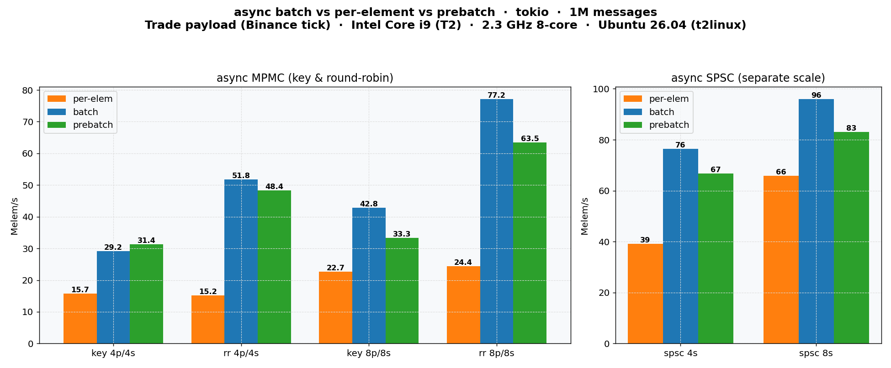


## Benchmark results — ARM (MACOS)

> Benchmarks use 1 000 000 messages per run; payload is a Binance trade tick (Copy struct, &'static str fields, ~80 B). Higher is better.

### sync_mpmc

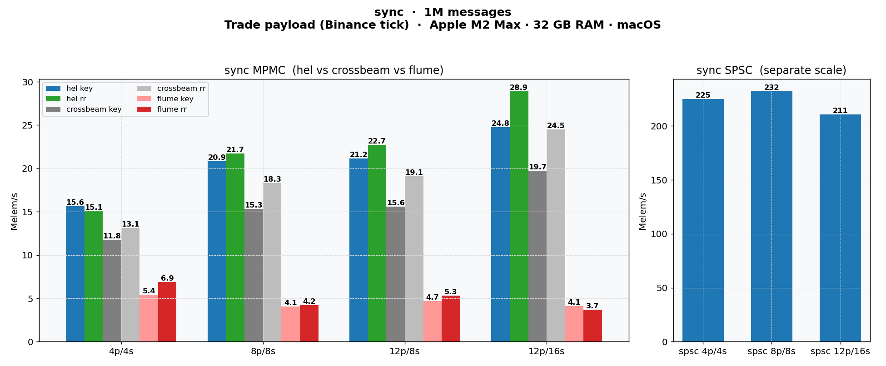

### async_sharded

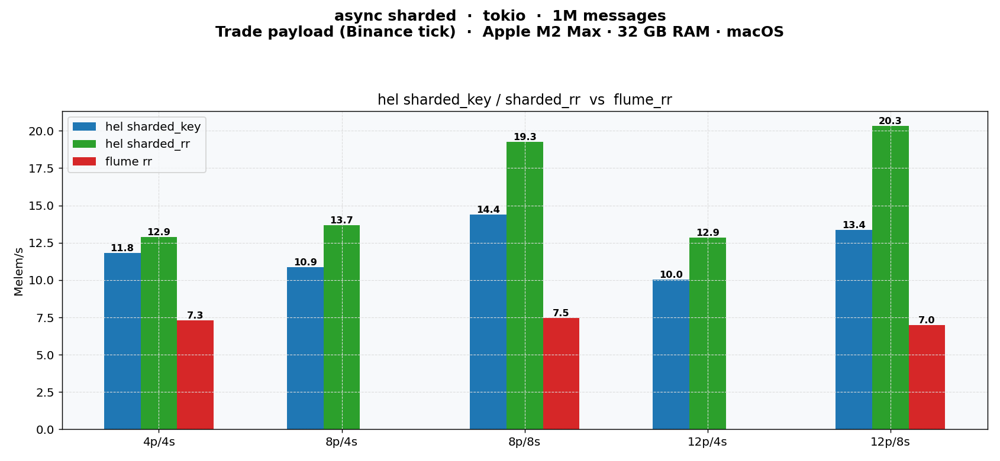

### scaling

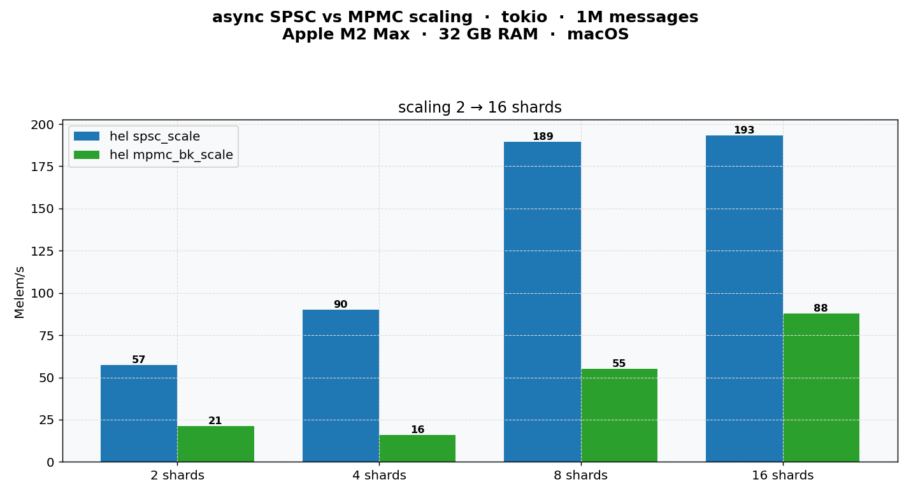

### batch

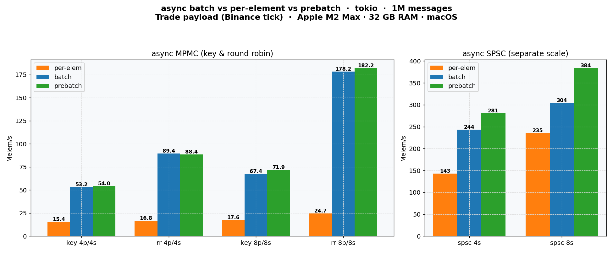

## Channel types

### `round_robin` — even load distribution

```rust
let (tx, rx) = round_robin::<u64, 256>(num_shards);
```

Each message goes to the next shard in sequence. No key needed.

**Use when:** workers are stateless — HTTP handlers, log processors, task queues.

### `shard_key` — ordering per key

```rust
let (tx, rx) = shard_key::<u64, 256>(num_shards);
tx.send("AAPL", value)?;
```

Routes by `hash(key) % num_shards`. The same key always reaches the same consumer.

**Use when:** order per entity matters — trading symbols, user sessions, actor systems.

### `shard_group` — explicit grouping (many keys → few shards)
```rust
let (tx, rx) = shard_group::<u64, 256>(ShardGroupCase::Groups {
    groups: &[
        &["BTCUSDT", "ETHUSDT"],   // group 0 → shard 0
        &["BTC-PERP", "ETH-PERP"], // group 1 → shard 1
    ],
});
let h = tx.handle("BTCUSDT").unwrap(); // resolve once
tx.send(h, value)?;                     // send by handle
```
Routes by an explicit user defined map: you decide which key goes to which shard,
not a hash. Resolve a key → shard handle once at subscription; Build from groups (`ShardGroupCase::Groups`) or from a classifier map (`ShardGroupCase::Map`).

**Use when:** many keys but few shards, with meaningful grouping; one consumer thread per group.

### `shard_spsc` — sharded SPSC

```rust
let ch = shard_spsc::<u64, 256>(num_shards);
let (shard_id, tx, rx) = ch.into_pairs().next().unwrap();
```

N independent SPSC channels. No shared state between shards at all.

**Use when:** you know the routing upfront — sensor streams, per-thread pipelines.

## API at a glance

```rust
// Sync
tx.send(value)?;
tx.send_timeout(value, Duration::from_millis(100))?;
let v = rx.recv()?;

// Async
tx.send_async(value).await?;
let v = rx.recv_async().await?;

// Batch (1.5–2× faster than per-element)
tx.send_batch(&mut buf)?;
rx.recv_batch(&mut buf, 64);

// Non-blocking
tx.try_send(value)?;
rx.try_recv()?;
```

Sync and async work on the same channel simultaneously — no conversion needed.

## Real world use cases

### Trading Risk Manager

Risk manager receives all orders from all strategies and checks limits before they reach the matching engine. Every order must be checked in symbol order — no two orders for the same symbol processed simultaneously.


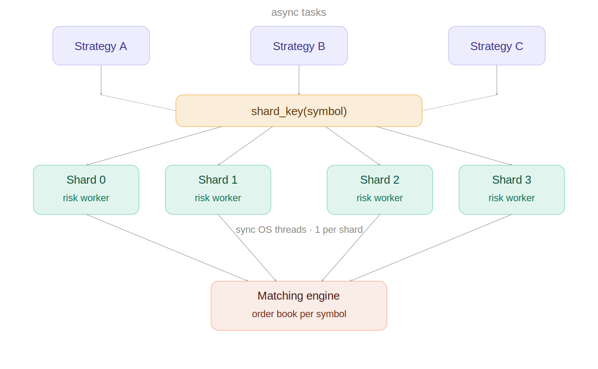

```rust
// Orders keyed by symbol → same symbol always hits same risk worker
// Risk worker checks position limits, exposure, drawdown synchronously
let (order_tx, order_rx) = shard_key::<Order, 1024>(8);

// Risk workers — sync, CPU-bound limit checking
let workers: Vec<_> = order_rx.into_receivers()
    .into_iter()
    .map(|rx| thread::spawn(move || {
        loop {
            match rx.recv() {
                Ok(order) => {
                    if risk_check(&order) {
                        matching_engine_tx.send(order).unwrap();
                    }
                }
                Err(RecvError::Disconnected) => break,
                Err(RecvError::TimeOut(_)) => unreachable!(),
            }
        }
    }))
    .collect();

// Strategy tasks — async, send orders with symbol as key
tokio::spawn(async move {
    let order = Order { symbol: "AAPL", qty: 100, price: 185.50 };
    order_tx.send_async(order.symbol, order).await?;
});
```

### Trading Matching Engine Core

Matching engine receives pre-validated orders. Each symbol has its own order book — maintained by one dedicated thread with no locking. Orders for the same symbol are always serialized.

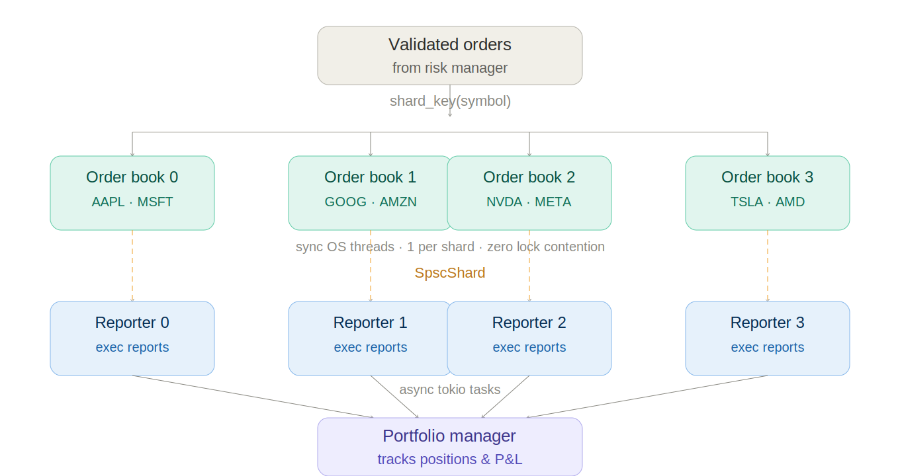

```rust
// Inbound: orders routed by symbol to book workers
let (inbound_tx, inbound_rx) = shard_key::<Order, 512>(num_shards);

// Outbound: each book worker has its own SPSC to execution report handler
let exec_reports = shard_spsc::<ExecutionReport, 256>(num_shards);

let handles: Vec<_> = inbound_rx
    .into_receivers()
    .into_iter()
    .zip(exec_reports.into_pairs())
    .map(|(order_rx, (_, report_tx, report_rx))| {
        // Order book worker — owns one symbol group, zero lock contention
        let worker = thread::spawn(move || {
            let mut book = OrderBook::new();
            loop {
                match order_rx.recv() {
                    Ok(order) => {
                        let fills = book.process(order);
                        for fill in fills {
                            report_tx.send(fill).unwrap();
                        }
                    }
                    Err(RecvError::Disconnected) => break,
                    Err(_) => unreachable!(),
                }
            }
        });

        // Execution report consumer — async, sends fills to portfolio manager
        let reporter = tokio::spawn(async move {
            loop {
                match report_rx.recv_async().await {
                    Ok(report) => portfolio_tx.send_async(report).await.unwrap(),
                    Err(AsyncRecvError::Disconnected) => break,
                }
            }
        });

        (worker, reporter)
    })
    .collect();
```

### Event-Driven System

A typical event-driven backend: ingestion layer receives raw events, routes them to typed processors, processed results fan out to subscribers.

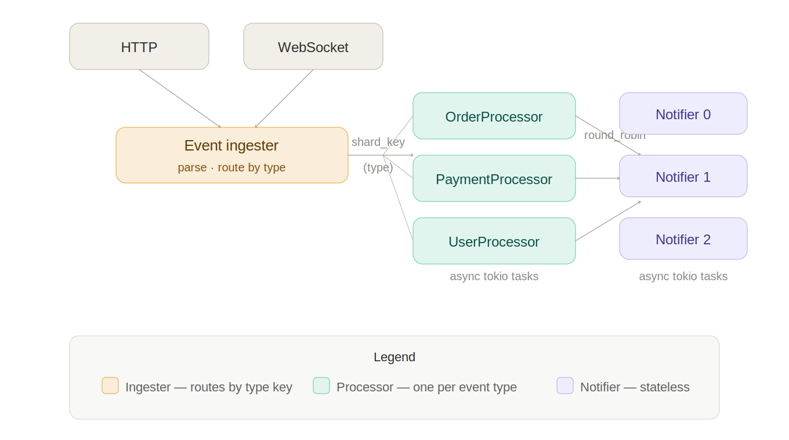

```rust
#[derive(Debug)]
enum Event {
    Order(OrderEvent),
    Payment(PaymentEvent),
    User(UserEvent),
}

// Route events by type — each processor handles one event kind
let (event_tx, event_rx) = shard_key::<Event, 512>(4);

// Processors — async, one per event type
let processors: Vec<_> = event_rx.into_receivers()
    .into_iter()
    .enumerate()
    .map(|(id, rx)| tokio::spawn(async move {
        loop {
            match rx.recv_async().await {
                Ok(Event::Order(e)) => process_order(e).await,
                Ok(Event::Payment(e)) => process_payment(e).await,
                Ok(Event::User(e)) => process_user(e).await,
                Err(AsyncRecvError::Disconnected) => break,
            }
        }
    }))
    .collect();

// Notifiers — round_robin, stateless fan-out to N notification workers
let (notify_tx, notify_rx) = round_robin::<Notification, 256>(4);

let notifiers: Vec<_> = notify_rx.into_receivers()
    .into_iter()
    .map(|rx| tokio::spawn(async move {
        loop {
            match rx.recv_async().await {
                Ok(n) => send_notification(n).await,
                Err(AsyncRecvError::Disconnected) => break,
            }
        }
    }))
    .collect();

// Ingester — reads from WebSocket, routes events by type string
tokio::spawn(async move {
    while let Some(raw) = ws_stream.next().await {
        let event: Event = parse(raw);
        let key = event.type_key(); // "order" | "payment" | "user"
        event_tx.send_async(key, event).await.unwrap();
    }
});
```

### Game Engine

hel fits game engines well for inter-system communication on multi-core hardware. Each game system (physics, AI, audio, rendering) runs on its own core and communicates via channels instead of shared mutable state.

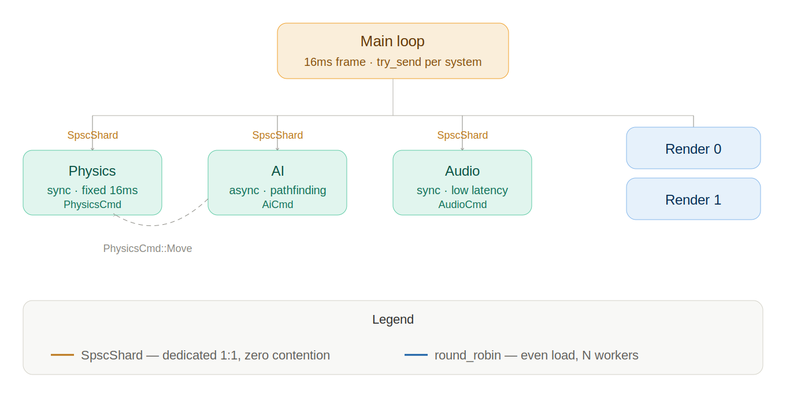


```rust
// Main loop → physics: SPSC, no contention, maximum throughput
let physics_ch  = SpscShard::<PhysicsCmd, 512>::new(1);
let ai_ch = SpscShard::<AiCmd, 256>::new(1);
let audio_ch = SpscShard::<AudioCmd, 256>::new(1);

// Main loop → render workers: round_robin across N render threads
let (render_tx, render_rx) = round_robin::<DrawCmd, 1024>(num_render_threads);

let (_, physics_tx, physics_rx) = physics_ch.into_pairs().next().unwrap();
let (_, ai_tx, ai_rx) = ai_ch.into_pairs().next().unwrap();
let (_, audio_tx, audio_rx) = audio_ch.into_pairs().next().unwrap();

// Physics worker — dedicated core, sync, deterministic timing
thread::spawn(move || {
    loop {
        match physics_rx.recv_timeout(Duration::from_millis(16)) {
            Ok(cmd) => physics_world.apply(cmd),
            Err(RecvError::TimeOut(_)) => physics_world.step(FIXED_DT),
            Err(RecvError::Disconnected) => break,
        }
    }
});

// AI worker — dedicated core, can use async for pathfinding futures
tokio::spawn(async move {
    loop {
        match ai_rx.recv_async().await {
            Ok(AiCmd::Think { entity }) => {
                let decision = pathfinder.find(entity).await;
                physics_tx.send(PhysicsCmd::Move(decision)).unwrap();
            }
            Err(AsyncRecvError::Disconnected) => break,
        }
    }
});

// Audio worker — sync, low latency
thread::spawn(move || {
    loop {
        match audio_rx.recv() {
            Ok(cmd) => audio_mixer.play(cmd),
            Err(RecvError::Disconnected) => break,
            Err(_) => break,
        }
    }
});

// Main loop — send commands each frame
loop {
    physics_tx.try_send(PhysicsCmd::Update(state)).ok();
    ai_tx.try_send(AiCmd::Think { entity: player }).ok();
    render_tx.send(DrawCmd::Frame(scene.snapshot())).unwrap();
    frame_timer.wait_next();
}
```

> **Note:** for game engines with strict frame budgets, `try_send` is often preferable over blocking `send` — drop the message if the worker is behind rather than stalling the main loop.

**Rule of thumb:**
```
num_shards = num_producers = num_consumers = num_physical_cores / 2
```

Each shard runs on its own core with no shared state between shards. This means:

- No cache line bouncing between cores for the common case
- ARM `fetch_add` lets all producers write simultaneously
- SPSC shards have zero atomic overhead between producer and consumer

**Apple M2 Max (12 P-cores):**
```
8 shards → best throughput for MPMC (8 producers, 8 consumers)
16 shards → best for SPSC scaling (349 M/s measured)
```

**Intel i9 8-core (16 logical):**
```
4 shards → best MPMC (1 producer per physical core, no HT contention)
8 shards → acceptable, slight HT overhead
```

**General guidance:**
```
num_shards > num_physical_cores → context switch overhead, latency spikes
num_shards < num_producers → contention on shared shards
num_shards = num_producers → optimal, each producer owns a shard
```

## Choosing the right channel

| Use case                              | Channel         | Why |
|---------------------------------------|-----------------|-----|
| Task queue, stateless workers         | `round_robin`   | Even load, no key needed |
| Trading, actors, sessions by key      | `shard_key`     | Ordering per entity |
| Sensor streams, per-thread pipelines  | `SpscShard`     | Zero contention |
| Physics / AI / audio in game engine   | `SpscShard`     | Dedicated core per system |
| Event routing by type                 | `shard_key`     | Type as routing key |
| Fan-out to N notification workers     | `round_robin`   | Stateless, even distribution |
| Many symbols grouped by type          | `shard_group`   | Explicit map, meaningful grouping |
| One consumer thread per sector/shard  | `shard_group`   | Many keys → few shards, you control routing |
| Sync thread → async task pipeline     | any hel channel | Mix freely |
| Async task → sync worker pipeline     | any hel channel | Mix freely |

## Limitations

**`num_shards` must be a power of two.** The ring buffer uses bitmasking for slot indexing.

**`shard_key` does not guarantee even load.** Distribution depends on `hash(key) % num_shards`. With few unique keys, some shards may be empty. Use `round_robin` when even distribution matters more than ordering.

**`shard_group` does not balance load automatically either.** Distribution
follows your map exactly: a group with more keys (or hot keys) gets a heavier
shard.

**Bounded only.** No unbounded channel. Capacity is a compile-time constant. This is intentional — bounded channels make backpressure visible.

**No native multi-channel select.** Fan-in via `recv_any()` works but at lower throughput than dedicated consumers.

**`send_timeout` on ARM falls back to CAS.** The `fetch_add` optimization only applies to `send()` without a deadline.

## When NOT to use hel

- You need an **unbounded** queue → use `flume` or `async-channel`
- You need **broadcast** (one message to all receivers) → use `tokio::broadcast`
- You have **1–2 producers** with no real contention → `crossbeam` or `std::sync::mpsc` are simpler
- You need **select over multiple channels** natively → `tokio::sync::mpsc` integrates better with `tokio::select!`

## Quick start

```rust
use hel::channel::mpmc::round_robin;
use hel::channel::errors::*;

let (tx, rx) = round_robin::<String, 256>(4);

for r in rx.into_receivers() {
    tokio::spawn(async move {
        loop {
            match r.recv_async().await {
                Ok(msg) => println!("got: {msg}"),
                Err(AsyncRecvError::Disconnected) => break,
            }
        }
    });
}

std::thread::spawn(move || {
    for i in 0..1000 {
        tx.send(format!("msg-{i}")).unwrap();
    }
});
```

## Capacity guidelines

```
CAP = 128 — low latency, small bursts
CAP = 256 — general purpose ← good default
CAP = 1024 — batch workloads, large producers
CAP = 4096 — high-throughput pipelines
```

`CAP` must be a power of two. Larger capacity reduces contention under load but uses more memory per shard: `size = CAP × sizeof(T) × num_shards`.

## Target Environment
hel is optimized for **bare metal and dedicated CPU** deployments.
For best results:
- num_shards ≤ num_physical_cores
- Dedicated CPU cores (no overcommit)
- Linux with NUMA awareness or macOS

For cloud VMs with shared vCPUs, consider crossbeam or flume.